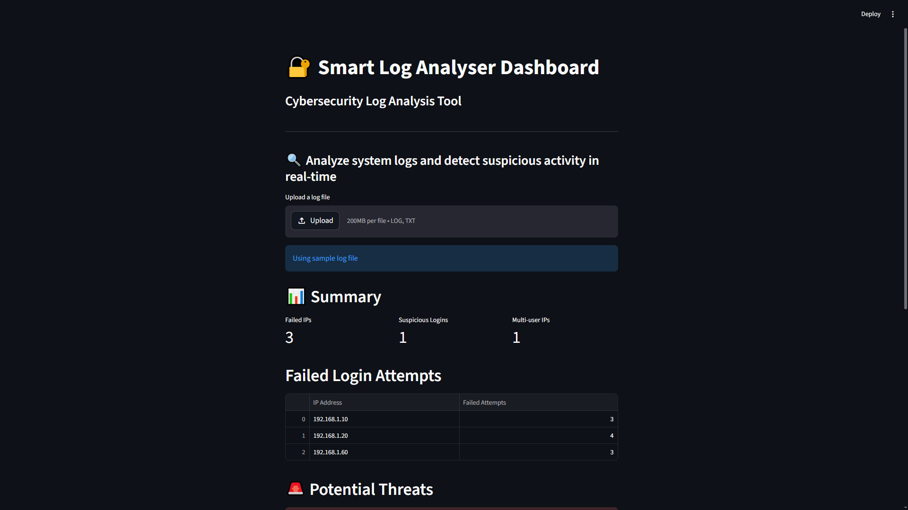
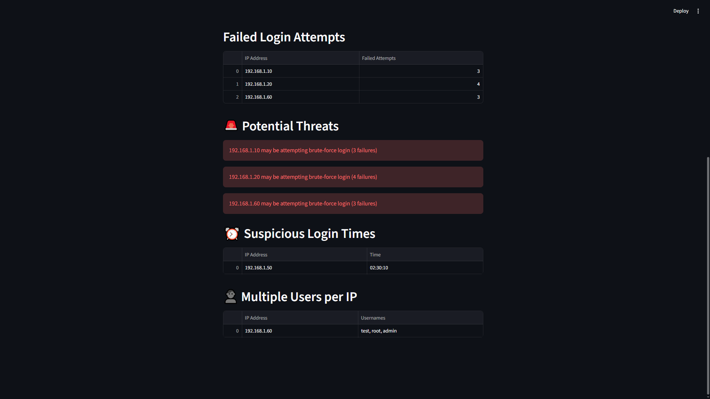

# 🔐 Smart Log Analyser

A Python-based cybersecurity tool that analyzes system logs to detect suspicious activity such as brute-force attacks, unusual login times, and multi-user access patterns.

---

## 🚀 Features

- Detects brute-force login attempts
- Identifies suspicious login times (midnight activity)
- Detects multiple usernames from the same IP
- Generates structured JSON reports
- Interactive dashboard using Streamlit
- Upload custom log files for analysis

---

## 🛠️ Tech Stack

- Python
- Streamlit
- Pandas

---

## 📊 Dashboard

Run the interactive dashboard:

```bash
python -m streamlit run app.py
```

---

## 📂 Project Structure

```bash
smart-log-analyser/
│
├── data/
│   └── sample.log
│
├── src/
│   ├── parser.py
│   ├── detector.py
│
├── screenshots/
│   └── output.png
│
├── app.py
├── main.py
├── report.json
├── requirements.txt
└── README.md
```

---

## 📌 Example Output

### Screenshot




---

## ⚙️ How to Run

### Run CLI version
```bash
python main.py
```

### Run Dashboard
```bash
python -m streamlit run app.py
```

---

## 📈 Future Improvements

- Add charts and graphs
- Add severity scoring for threats
- Support real-world log formats
- Export reports via dashboard

---

## 👤 Author
Prakash Sharma