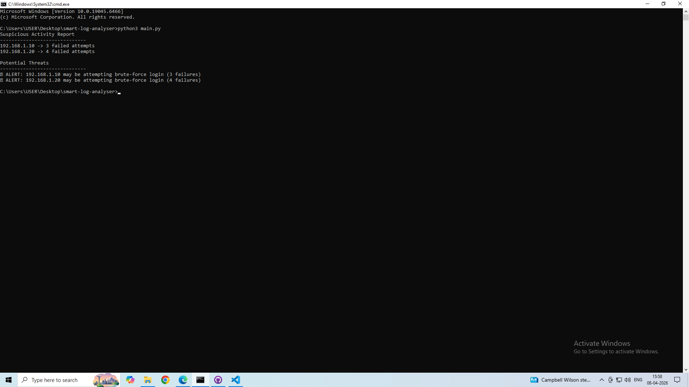

# Smart Log Analyser

Smart Log Analyser is a beginner-friendly Python cybersecurity project that reads authentication logs and detects suspicious failed login activity.

This project was built to simulate how a security analyst can identify brute-force login attempts from raw log data.

---

## Features

- Reads log files line by line
- Detects failed login attempts
- Extracts suspicious IP addresses
- Counts repeated login failures
- Flags possible brute-force attack behavior

---

## Technologies Used

- Python
- File Handling
- String Parsing
- Basic Cybersecurity Detection Logic

---

## Project Structure

```bash
smart-log-analyser/
│
├── data/
│   └── sample.log
│
├── src/
│   ├── parser.py
│   └── detector.py
│
├── main.py
├── README.md
├── requirements.txt
└── .gitignore
```

---

## How to Run

### 1. Clone the repository

```bash
git clone https://github.com/1prakash2sharma/smart-log-analyser.git
cd smart-log-analyser
```

### 2. Run the project

```bash
python main.py
```

---

## Example Log Input

```txt
2026-04-08 10:00:01 Failed login from 192.168.1.10 user=admin
2026-04-08 10:00:05 Failed login from 192.168.1.10 user=admin
2026-04-08 10:00:10 Failed login from 192.168.1.10 user=admin
2026-04-08 10:01:00 Successful login from 192.168.1.15 user=john
2026-04-08 10:02:15 Failed login from 192.168.1.20 user=root
2026-04-08 10:02:20 Failed login from 192.168.1.20 user=root
2026-04-08 10:02:30 Failed login from 192.168.1.20 user=root
2026-04-08 10:02:40 Failed login from 192.168.1.20 user=root
```

---

## Example Output

```txt
Suspicious Activity Report
------------------------------
192.168.1.10 -> 3 failed attempts
192.168.1.20 -> 4 failed attempts

Potential Threats
------------------------------
⚠ ALERT: 192.168.1.10 may be attempting brute-force login (3 failures)
⚠ ALERT: 192.168.1.20 may be attempting brute-force login (4 failures)
```

---

## Why This Project Matters

In real-world cybersecurity, logs are one of the most important data sources for:
- incident detection
- brute-force monitoring
- suspicious login analysis
- attacker behavior tracking

This project demonstrates a beginner-level security detection workflow using Python.

---

## Future Improvements

- Add timestamp-based attack windows
- Add failed login threshold tuning
- Export results to JSON or CSV
- Add a Streamlit dashboard
- Add support for larger real-world log files

---

## Author

Built by Prakash Sharma

## Example Output

### Screenshot


### Terminal Output

```txt
Suspicious Activity Report
------------------------------
192.168.1.10 -> 3 failed attempts
192.168.1.20 -> 4 failed attempts

Potential Threats
------------------------------
⚠ ALERT: 192.168.1.10 may be attempting brute-force login (3 failures)
⚠ ALERT: 192.168.1.20 may be attempting brute-force login (4 failures)
```